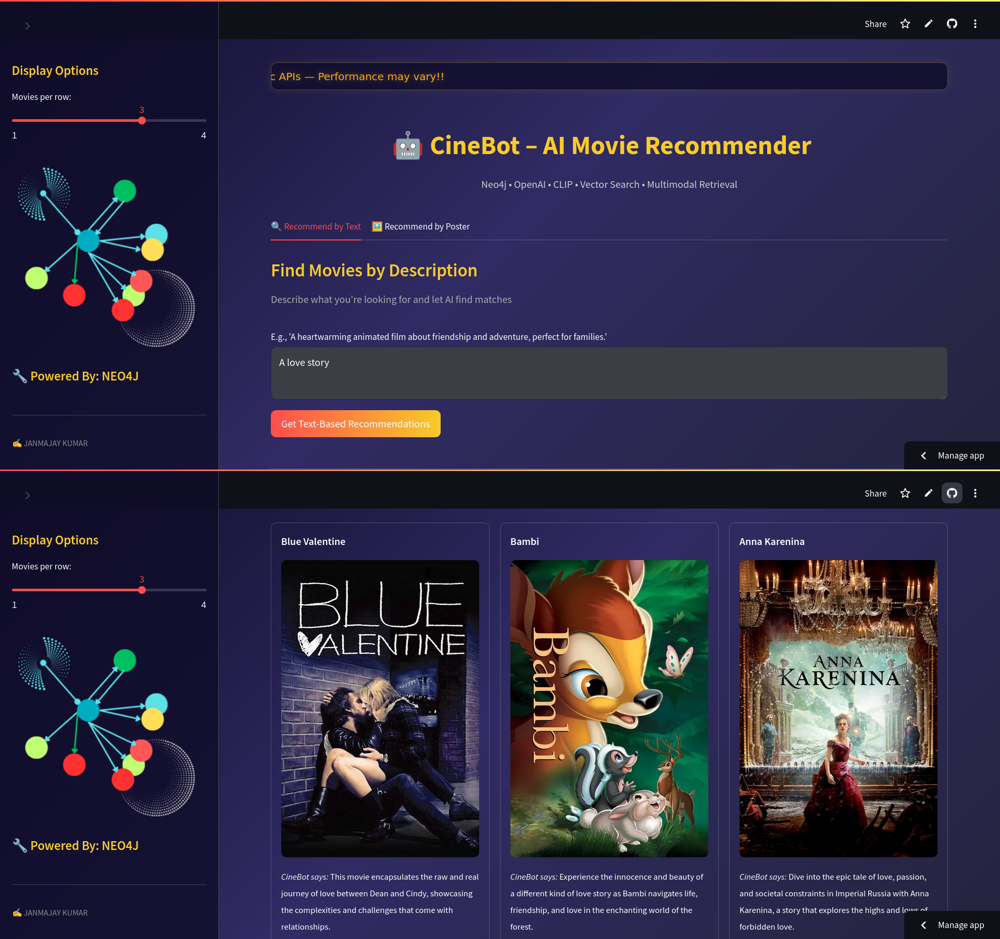

# Graph-Powered Retrieval-Augmented Generation (RAG) for Smarter Recommendations

Description: This project demonstrates the integration of Retrieval-Augmented Generation (RAG) with 
graph databases (Neo4j) and Large Language Models (LLMs) to create an intelligent and scalable recommendation
system. By leveraging the structured nature of graph databases and the dynamic
capabilities of LLMs, the system delivers contextually relevant and accurate recommendations for movies.
<p align="center">
  
</p>

# Key Features 
  * Graph Database Integration: Utilizes Neo4j to structure and query complex data relationships efficiently.
  * Retrieval-Augmented Generation: Combines external data retrieval with generative AI to reduce hallucinations and improve response accuracy.
  * Movie Recommendations: Provides movie recommendations and contextual answers based on user queries.
  * Embeddings and Similarity: Leverages semantic embeddings to find similar movies dynamically.
  * Interactive Interface: A user-friendly Streamlit-based web application for an engaging user experience.

# Technology Stack:
  * Neo4j: Graph database for storing and querying movie data.
  * Streamlit: Interactive UI framework for seamless user interaction.
  * LangChain: Framework for LLM-powered chain integrations.
  * SentenceTransformers: For generating semantic embeddings.
  * Fuzzy Matching: Enhances query accuracy for movie recommendations.
  * TMDb API: Fetches movie posters and metadata.

# How It Works:
  * Data Storage: Movies and relationships are stored in Neo4j as nodes and edges.
  * Semantic Search: Queries are processed using semantic embeddings to retrieve contextually similar movies.
  * RAG Workflow: LLMs augment responses by retrieving relevant data from Neo4j.
  * Dynamic Recommendations: Personalized recommendations and answers are generated based on user input.


# Setup Instructions:
  1. Clone the repository:

     ```
        git clone https://github.com/QED137/CineBot.git
        cd cineBoat
 2. Install Dependencies

    ```
     pip install -r requirements.txt
3. Set up your Neo4j database and .env file with credentials.
4.  Run app:

   ```
    streamlit run app.py
```
# Use cases :
 * Personalized Movie Recommendations: Find movies similar to your favorites.
 * Knowledge Retrieval: Ask movie-related questions like "Who directed Inception?" or "What movies came out after 2010?"
 * Interactive Learning: Understand the power of combining RAG with graph-based systems.
## License
  MIT
