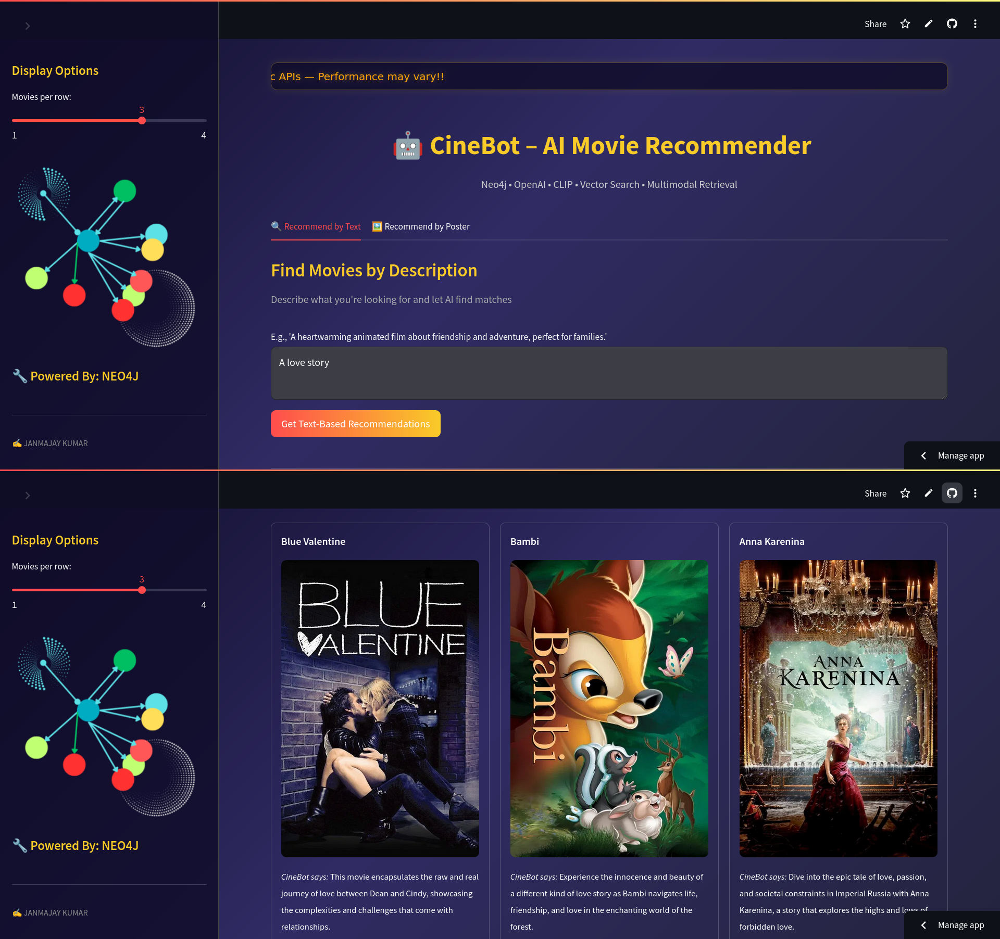

# CineBot

CineBot is a graph-powered movie recommendation and discovery application built with FastAPI, React, Neo4j, and OpenAI. It supports conversational movie search, poster-based discovery, and curated film reading content from major movie blogs.

<p align="center">
   
</p>

## What this project does

- Conversational movie recommendations with context-aware responses
- Graph-based retrieval from Neo4j to improve recommendation relevance
- Poster image query support for visual movie discovery
- Curated film reading tabs:
   - Articles from multiple sources
   - 10 Best Lists from Taste of Cinema
- Live keyword search against Taste of Cinema in the 10 Best Lists tab
- Mobile-optimized interface with compact header, touch-friendly controls, and back-to-top buttons

## Architecture

- Backend: FastAPI API server (`app_fastapi.py`)
- Frontend: React + Vite (`frontend/`)
- Graph database: Neo4j (local Docker or Aura)
- Caching: Redis (optional; in-memory fallback if unavailable)
- Content feeds: RSS ingestion with source-aware search (`external_apis/rss_feed_client.py`)

## Repository structure

- `app_fastapi.py`: Main FastAPI app and API routes
- `core/`: Retrieval, ranking, Cypher generation, caching, recommendation services
- `external_apis/`: TMDB client and RSS feed aggregation/search
- `frontend/`: React UI (chat, articles, 10 best lists, mobile layout)
- `config/`: Environment and runtime settings
- `docker-compose*.yml`: Local/dev/production compose definitions

## Prerequisites

- Python 3.10+
- Node.js 18+
- Neo4j (local Docker or Aura)
- Redis (optional)
- OpenAI API key

## Environment configuration

Create an `.env` file in the project root and configure required values.

Typical required variables include:

- `OPENAI_API_KEY`
- `NEO4J_URI`
- `NEO4J_USERNAME`
- `NEO4J_PASSWORD`

Optional values (if used in your setup):

- `REDIS_HOST`
- `REDIS_PORT`
- `TMDB_API_KEY`

This repository is documented for local development and demonstration.

## Local development

### 1) Clone and install backend dependencies

```bash
git clone https://github.com/QED137/CineBot.git
cd CineBot
python3 -m venv .venv
source .venv/bin/activate
pip install -r requirements.txt
```

### 2) Start data services

Option A: Local Docker services

```bash
./start-local-dev.sh
```

Option B: External services

- Use Neo4j Aura or your own Neo4j instance
- Start Redis if you want Redis caching enabled

### 3) Start backend

```bash
./start_fastapi.sh
```

or

```bash
uvicorn app_fastapi:app --host 0.0.0.0 --port 8000 --reload
```

### 4) Start frontend

```bash
cd frontend
npm install
npm run dev
```

### 5) Open the app

- Frontend: `http://localhost:3001` (or the port shown by Vite)
- Backend health check: `http://localhost:8000/api/health`

## Key API endpoints

- `POST /api/chat`: Text or poster-based movie query
- `GET /api/suggestion`: Random query suggestion
- `GET /api/health`: Service health
- `GET /api/articles`: Aggregated articles
   - Params: `limit`, `source`, `search`
- `GET /api/articles/featured`: Featured industry articles
- `GET /api/articles/sources`: Available RSS sources

## Troubleshooting

- If backend starts but Redis is unavailable, the app can continue with in-memory caching.
- If article search results seem limited, verify backend is restarted after RSS search changes.
- If local services conflict, stop old processes and restart backend/frontend terminals.

## Additional documentation

- [ARCHITECTURE.md](ARCHITECTURE.md)
- [FASTAPI_MIGRATION.md](FASTAPI_MIGRATION.md)
- [REDIS_SETUP.md](REDIS_SETUP.md)
- [PRODUCTION_OPTIMIZATION.md](PRODUCTION_OPTIMIZATION.md)
- [LOCAL_NEO4J_SETUP.md](LOCAL_NEO4J_SETUP.md)

## License

MIT
